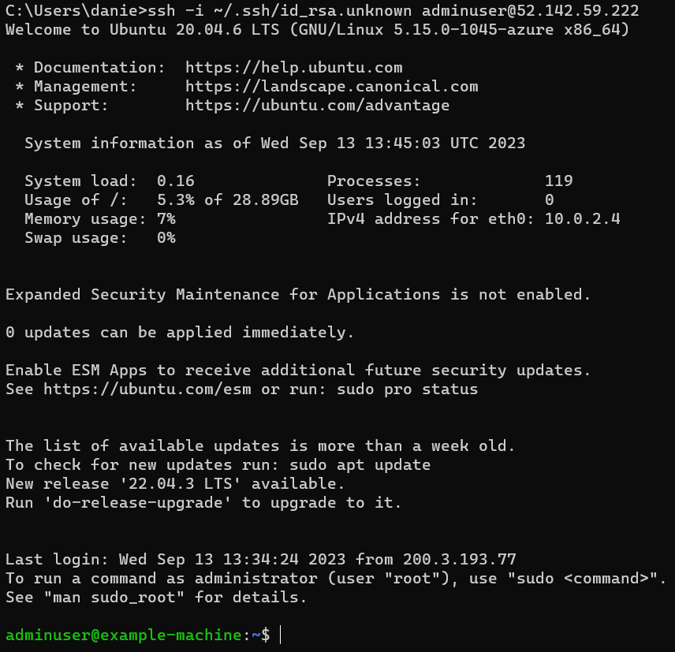
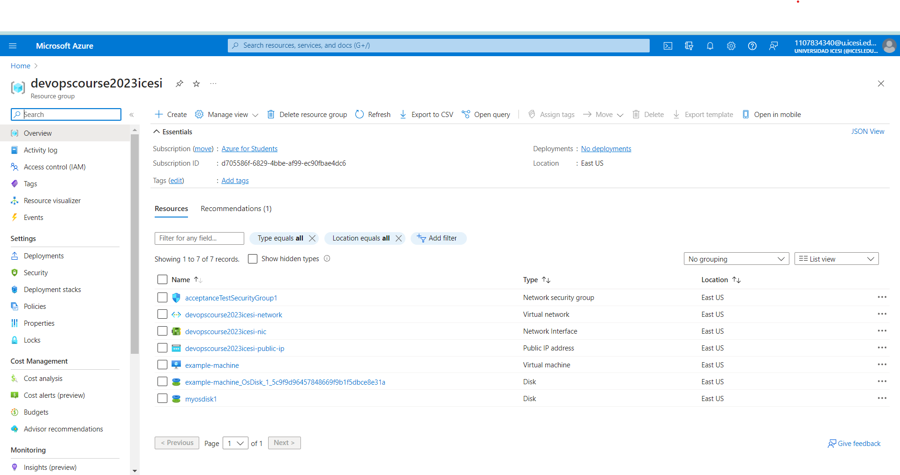

# Azure virtual machine with Terraform

This repository contains the necessary Terraform configuration files to create a Resource Group and Virtual Machine in Azure.

## Description 👩‍💻

The main goal of this repository is to provide an automated and easy way to deploy a Resource Group neccesary to create a Virtual Machine in Azure using Terraform. Terraform is an open-source tool that allows developers to provide a high-level description of the environment they want to build, making it easy to create, change, and improve infrastructure safely and efficiently.

## Features :wrench:

* Automated creation of a Resource Group in Azure.
* Automated deployment of a Virtual Machine within the Resource Group.
* Easily customizable configuration through the variables.tf file.
* Code written following Terraform best practices.

## Resource Group :computer:

The set of resources needed to create an Azure virtual machine are:

* Provider definition
* The Resource Group
* Storage Account
* Servive Plan for specifying the service level 
* Virtual Network
* Subnet
* Public IP
* Network interface
* Security group and rules
* Associate the network interface with the security group 
* Virtual machine

## Files :file_folder:
* **terraform.tfvars** - Contains the values of the variables declared in variables.tf.
* **variables.tf** - Specification of the variables, type and their description used in the main.tf file.
* **main.tf** - Contains all the necessary code to create the infrastructure resources that the virtual machine needs.
* **output.tf** - Code to show the public ip of the virtual machine as output.

### After we create the files, we should execute:

    1. terraform init - Download the providers.
    2. terraform validate - Validates the syntax of the tf files.
    3. terraform plan - Displays the changes to be applied.
    4. terraform apply - Applies the changes to the tf code.
    5. terraform destroy - Destroys the created infrastructure..

## Evidence :iphone:

