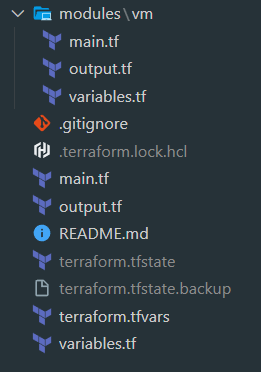
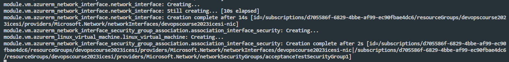
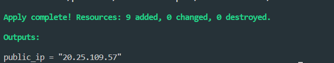
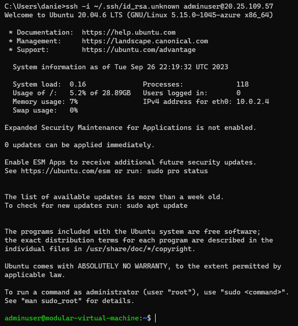

# Azure virtual machine with Terraform

This repository contains the necessary Terraform configuration files to create a Resource Group and a modular Virtual Machine in Azure.

## Description 👩‍💻

The main goal of this repository is to provide an automated and easy way to deploy a Resource Group neccesary to create a Virtual Machine in Azure using Terraform. Terraform is an open-source tool that allows developers to provide a high-level description of the environment they want to build, making it easy to create, change, and improve infrastructure safely and efficiently.

## Pre-requisites
* Terraform installed
* Azure CLI installed
* Azure login
## Features :wrench:

*
* Automated creation of a Resource Group in Azure.
* Automated deployment of a modular Virtual Machine within the Resource Group.
* Easily customizable configuration through the variables.tf file.
* Code written following Terraform best practices.


## Resource Group :computer:

The set of resources needed to create an Azure virtual machine are:

* Provider definition
* The Resource Group
* Storage Account
* Servive Plan for specifying the service level 
* Virtual Network
* Subnet
* Public IP
* Network interface
* Security group and rules
* Associate the network interface with the security group 
* Virtual machine

## How to start?
We need to create a folder containing the following files
** **variables.tf** - Specification of the variables, type and their description used in the main.tf file.
** **terraform.tfvars** - Contains the values of the variables declared in variables.tf.
* **main.tf** - Contains all the necessary code to create the infrastructure resources that the virtual machine needs.
* **output.tf** - Code to display the public ip found in the modules/vm output.

Then, create a subfolder **modules** 
* Inside modules create a **vm** folder and create the following files:
    * **main.tf** - Contains the code to create infrastructure resources in the module.
    * **variables.tf** - Local variables used in the main.tf file in the modules/vm folder.
    * **output.tf** - Contains the code to display the public ip
 


## Step 2
Variables.tf in the module
```
variable "name_machine" {
    type = string
    description = "Name machine that is used as prefix for the resources"
}

variable "location"{
    type = string
    default = "West Europe"
    description = "Location"
}

variable "resource_group_name"{
    type = string
    description = "Name of the resource group"
}

variable "subnet_id" {
    type = string
    description = "Subnet id"
}

variable "username"{
    type = string
    description = "Username ssh vm"
}
```
## Step 3
main.tf in the module
```

# Create public IPs
resource "azurerm_public_ip" "my_terraform_public_ip" {
  name                = "${var.name_machine}-public-ip"
  location            = var.location
  resource_group_name = var.resource_group_name
  allocation_method   = "Static"
}

#Se crea la interfaz de red
resource "azurerm_network_interface" "network_interface" {
  name                = "${var.name_machine}-nic"
  location            = var.location
  resource_group_name = var.resource_group_name

  ip_configuration {
    name                          = "testconfiguration1"
    subnet_id                     = var.subnet_id
    public_ip_address_id          = azurerm_public_ip.my_terraform_public_ip.id
    private_ip_address_allocation = "Dynamic"
  }
}

#Se crea el grupo de seguridad y las reglas
resource "azurerm_network_security_group" "security_group" {
  name                = "acceptanceTestSecurityGroup1"
  location            = var.location
  resource_group_name = var.resource_group_name

  security_rule {
    name                       = "SSH"
    priority                   = 1001
    direction                  = "Inbound"
    access                     = "Allow"
    protocol                   = "Tcp"
    source_port_range          = "*"
    destination_port_range     = "22"
    source_address_prefix      = "*"
    destination_address_prefix  = "*"
    }


    tags = {
    environment = "Production"
  }
}

resource "azurerm_network_security_rule" "rule_icmp" {
  name                       = "PING"
  priority                   = 1000
  direction                  = "Inbound"
  access                     = "Allow"
  protocol                   = "Icmp"
  source_port_range          = "*"
  destination_port_range     = "*"
  source_address_prefix      = "*"
  destination_address_prefix  = "*"
  resource_group_name         = var.resource_group_name
  network_security_group_name = azurerm_network_security_group.security_group.name
}


#Asociar interfaz con el grupo de seguridad
resource "azurerm_network_interface_security_group_association" "association_interface_security" {
  network_interface_id      = azurerm_network_interface.network_interface.id
  network_security_group_id = azurerm_network_security_group.security_group.id
}

#Se crea la máquina virtual de linux
resource "azurerm_linux_virtual_machine" "linux_virtual_machine" {
  name                = "modular-virtual-machine"
  resource_group_name = var.resource_group_name
  location            = var.location
  size                = "Standard_F2"
  admin_username      = var.username
  network_interface_ids = [
    azurerm_network_interface.network_interface.id,
  ]

  admin_ssh_key {
    username   = var.username
    public_key = file("C:/Users/danie/.ssh/id_rsa.pub")
  }

  os_disk {
    caching              = "ReadWrite"
    storage_account_type = "Standard_LRS"
  }

  source_image_reference {
    publisher = "Canonical"
    offer     = "0001-com-ubuntu-server-focal"
    sku       = "20_04-lts"
    version   = "latest"
  }
}
```

## Step 4
output.tf in the module
```
    output "public_ip_address" {
    value = azurerm_public_ip.my_terraform_public_ip.ip_address
    }
```

## Step 5
Updated main.tf file in the root directory
```
# Definición del provider que ocuparemos
provider "azurerm" {
  features {}
}

# Se crea el grupo de recursos, al cual se asociarán los demás recursos
resource "azurerm_resource_group" "vm" {
  name     = var.name_machine
  location = var.location
}


#Se crea la red
resource "azurerm_virtual_network" "virtual_network" {
  name                = "${var.name_machine}-network"
  address_space       = ["10.0.0.0/16"]
  location            = azurerm_resource_group.vm.location
  resource_group_name = azurerm_resource_group.vm.name
  dns_servers         = ["10.0.0.4", "10.0.0.5"]
  tags = {
    environment = "Production"
  }
}

#Se crea la subred
resource "azurerm_subnet" "internal_subnet" {
  name                 = "internal"
  resource_group_name  = azurerm_resource_group.vm.name
  virtual_network_name = azurerm_virtual_network.virtual_network.name
  address_prefixes     = ["10.0.2.0/24"]
}

module "vm" {
  source = "./modules/vm"
  name_machine = var.name_machine
  location = azurerm_resource_group.vm.location
  resource_group_name = azurerm_resource_group.vm.name
  subnet_id = azurerm_subnet.internal_subnet.id
  username = var.username
}
```
## Step 6
Updated output.tf file in the root directory
```
output "public_ip"{
    value = module.vm.public_ip_address
}
```

## Terraform commands
Once the code is ready, the following terraform commands are executed:
1. **terraform init** - Download the providers.
2. **terraform validate** - Validates the syntax of the tf files.
3. **terraform plan** - Displays the changes to be applied.
4. **terraform apply** - Applies the changes to the tf code.

## Evidence :iphone:
Execution of the terraform apply command:



Apply complete:



Virtual machine login:



Resource group:


